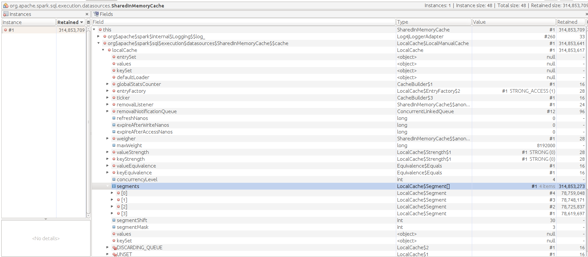

# spark-retrain-bug

This is a reproducible for a probable-spark bug.

```
To run: sbt -mem 1500 run
```

The program in a loop:

* Trains based on the data files found at: data/ folder. The data set is subset of data of amazon electronic dataset which can be found at: http://jmcauley.ucsd.edu/data/amazon/
* It simply calculates tf-idf of the terms after (Tokenizer -> Stopword remover -> stemming -> tf -> tfidf)
* Once the training is complete, it unpersists and starts the operation again.

After about 10 runs (takes ~20minutes), it ends with OOME. 

## Heap dump details

The biggest objects in the heapdump:


Further debug:


